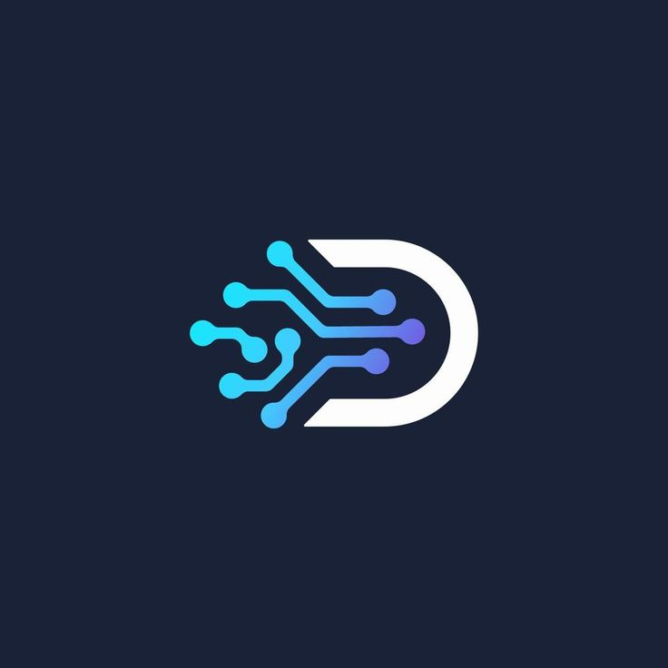

<div align="center">



# RedOps Hub

**Mobile Command Center for Red Team Operations**

[](https://flutter.dev)
[](https://firebase.google.com)
[](https://android.com)
[](LICENSE)
[](https://github.com/AbdoFawzi/redops_hub/releases)

*The first professional mobile platform built exclusively for Red Team operators.*

[Download APK](#download) · [Features](#features) · [Screenshots](#screenshots) · [Roadmap](#roadmap)

</div>

---

## What is RedOps Hub?

RedOps Hub is a tactical mobile application designed for penetration testers and Red Team operators who need a professional command center in their pocket.

Most security tools are built for desktops — requiring operators to stay chained to a laptop during multi-day engagements. RedOps Hub changes that by bringing the entire operation management workflow to mobile, secured with military-grade encryption.

> **Built by operators. For operators.**

---

## Features

### Tactical Authentication
- Google & GitHub OAuth login via Firebase
- Offline mode — full local access when no network is available
- Session persistence with secure token storage

### Lockdown System
- 4-digit PIN with encrypted local storage
- Biometric authentication (fingerprint / face)
- Progressive lockout — 3 failed attempts triggers increasing time-based blocks
- Auto-lock on background

### Vulnerability Tracker
- Log findings instantly with severity levels (Critical / High / Medium / Low / Info)
- CVE lookup and live threat intelligence feed
- Offline-first with Hive — works with zero connectivity
- Real-time sync to Firestore when online

### Payload Vault
- Encrypted local library of scripts and cheat sheets
- Categories: Web · Active Directory · Network · Privilege Escalation · Post Exploitation · Evasion
- One-tap copy to clipboard
- Instant search across all payloads

### C2 Dashboard
- Monitor active agent sessions
- Real-time beacon tracking via WebSocket
- Quick command dispatch from mobile
- Session metadata: hostname, IP, OS, privilege level

### Field Reporter
- Write intelligence notes and findings during live operations
- Voice-to-text transcription (coming in v2.0)
- AI auto-classification of findings (coming in v2.0)
- Converts notes directly into vulnerability tickets

### Dev Playbooks
- Secure code remediation guides for developers
- Categories: Web · Android · API · Auth · Database
- Side-by-side vulnerable vs. secure code examples
- One-tap copy of fix snippets

### Security Architecture
- AES-256 encryption on all local data via Hive
- Keys stored in Android hardware-backed Keystore
- Certificate pinning on all API connections
- Screenshot prevention (FLAG_SECURE)
- No telemetry, no analytics, no third-party SDKs phoning home
- Offline-first — sensitive data never leaves the device unless explicitly synced

---

## Tech Stack

| Layer | Technology |
|---|---|
| Framework | Flutter 3.x + Dart |
| Architecture | Clean Architecture (data / domain / presentation) |
| State Management | Riverpod 2.x |
| Navigation | GoRouter |
| Local Database | Hive + AES-256 encryption |
| Remote Backend | Firebase (Auth + Firestore + Storage + FCM) |
| Authentication | Google OAuth + GitHub OAuth + Biometrics + PIN |
| Network | Dio + WebSocket |
| Localization | English + Arabic |

---

## Download

### v1.0.0 — Early Access

> Requires Android 8.0 (API 26) or higher

| Platform | Link | Size |
|---|---|---|
| Android APK | [Download](https://github.com/AbdoFawzi/redops_hub/releases/latest) | ~18 MB |

**Installation:**
```
1. Download the APK
2. Enable "Install from unknown sources" in Android settings
3. Install and launch RedOps Hub
4. Sign in with Google or GitHub — or continue offline
```

---

## Screenshots

| C2 Dashboard | Vuln Tracker | Payload Vault | Dev Playbooks |
|---|---|---|---|
|  |  |  |  |

---

## Project Structure

```
lib/
├── core/
│   ├── bootstrap/        App initialization
│   ├── constants/        App-wide constants
│   ├── firebase/         Firebase bootstrap service
│   ├── router/           GoRouter config + routes
│   ├── security/         Biometrics + AES key management
│   ├── theme/            Colors + typography + Material3
│   └── localization/     EN + AR translations
├── shared/
│   └── widgets/          Reusable UI components
└── features/
    ├── auth/             Tactical auth + PIN + lockout
    ├── c2_dashboard/     Command & Control monitoring
    ├── vuln_tracker/     Vulnerability management
    ├── field_reporter/   Field notes + reporting
    ├── payload_vault/    Encrypted script library
    ├── dev_playbooks/    Secure code remediation
    ├── notifications/    Push alerts
    └── settings/         Profile + C2 config + theme
```

---

## Roadmap

### v1.0.0 — Current ✅
- [x] Tactical Auth (Google + GitHub + Offline)
- [x] PIN + Biometrics + Progressive Lockout
- [x] Vulnerability Tracker (offline-first)
- [x] Payload Vault (encrypted)
- [x] C2 Dashboard
- [x] Field Reporter
- [x] Dev Playbooks
- [x] Dark/Light theme
- [x] Arabic + English localization

### v2.0.0 — In Development 🔄
- [ ] Firestore real-time sync
- [ ] Push notifications (FCM)
- [ ] Voice-to-text Field Reporter
- [ ] AI finding classification
- [ ] Team collaboration + shared projects

### v3.0.0 — Planned 📋
- [ ] PDF report generation
- [ ] HTML client report export
- [ ] C2 framework integration (Sliver / Havoc)
- [ ] Desktop version (Windows / Linux)
- [ ] Web dashboard

---

## Legal Disclaimer

> RedOps Hub is designed exclusively for **authorized security testing and penetration testing engagements**.
>
> Use of this tool against systems without explicit written permission from the system owner is illegal and unethical. The developers assume no liability for misuse.
>
> **Always get written authorization before testing.**

---

## License

```
MIT License — Copyright (c) 2026 Abdo Fawzi
```

---

<div align="center">

**RedOps Hub** — Built for operators who move fast and stay silent.

[⬇️ Download](https://github.com/AbdoFawzi/redops_hub/releases) · [🌐 Website](https://redops-hub.web.app) · [📧 Contact](mailto:contact@redopshub.com)

</div>